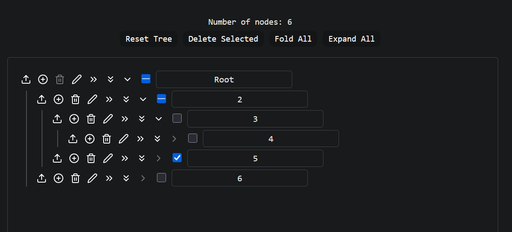

# react-tree-view
To practise hierarchical data rendering in React.

## Features
- Efficient rendering and rerendering of large trees
- Expand or collapse tree nodes
- Recursively expand or collapse tree nodes
- Checkboxes which update parent and child nodes
- Delete selected nodes



## To run

```bash
npm install
npm start
```


